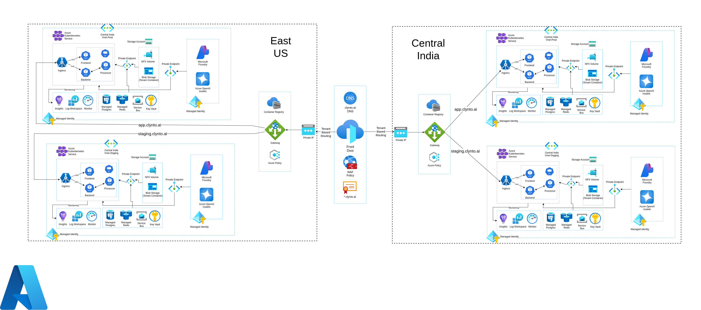
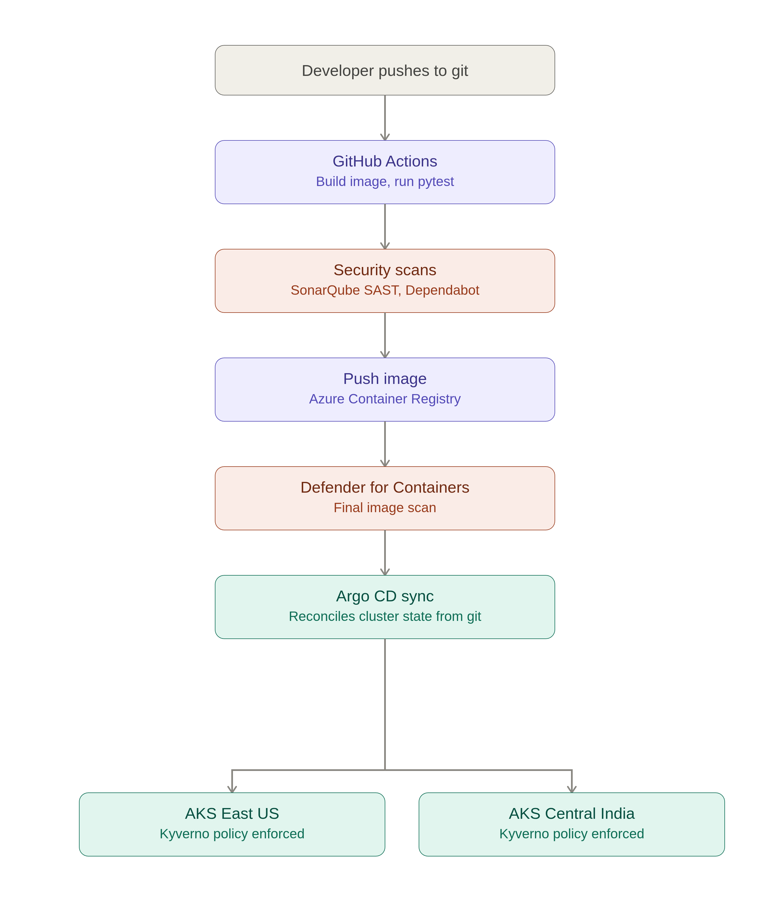

# Case Study: Building a Secure, Multi-Region CI/CD and Cloud Platform for an AI-First Customer Success Startup

## 1. The Challenge

**The client:** Clynto AI, an AI-first Customer Success platform serving customers across the United States and India, built on a multi-tenant SaaS model with AI workloads powered by Azure OpenAI.

**The problem:** Clynto AI was launching simultaneously in two regulatory jurisdictions — the US and India — with no existing infrastructure to build on. This created a unique challenge: rather than migrating away from a legacy system, Clynto AI needed a **production-grade, compliant, multi-region platform from day one**, without slowing down time-to-market or building two disconnected, hard-to-maintain stacks per region.

Specific constraints included:
- Customer traffic in **East US** and **Central India** needed to be routed to the correct region transparently, while each region carried **different compliance obligations** (GDPR in East US, PCI-DSS in Central India).
- Clynto AI needed a **safe staging environment** that mirrored production exactly, so releases could be validated before reaching live tenants.
- The public-facing surface had to cleanly support **three domains** — `clynto.ai` (marketing site), `app.clynto.ai` (production app), and `staging.clynto.ai` (pre-prod) — behind a single, secure entry point.
- As an AI platform, **Kubernetes API access and cluster policy enforcement** had to be tightly controlled to meet compliance audit requirements, not just "best effort" RBAC.
- All of this needed to be delivered **cost-consciously** — avoiding over-provisioning, idle compute, and unnecessary cross-region data transfer — since this was an early-stage startup, not an enterprise with unlimited cloud budget.

## 2. The Solution

**The solution:** I was engaged as a solo Azure Cloud Architect to design and build Clynto AI's entire cloud foundation: two independent AKS clusters (East US, Central India), each running a mirrored prod/staging topology, fronted by a single Azure Front Door instance that performs tenant-aware regional routing and domain-based traffic splitting across `clynto.ai`, `app.clynto.ai`, and `staging.clynto.ai`.

The platform was built around four pillars:
1. **GitOps-driven delivery** — GitHub Actions builds, scans, and tests every change; Argo CD continuously reconciles AKS cluster state from Git, removing manual `kubectl apply` from the deployment path entirely.
2. **Shift-left security** — SAST scanning (SonarQube), dependency scanning (Dependabot), and container image scanning (Microsoft Defender for Containers) run before any image reaches the registry, with Kyverno enforcing cluster-level policy at admission time.
3. **Compliance-aware multi-region design** — Azure Policy enforces GDPR controls in East US and PCI-DSS controls in Central India as code, not as a manual checklist.
4. **Resilience by design** — redundant data tier (Managed PostgreSQL, Managed Redis, geo-redundant Storage), AKS configured for high availability, and a tested disaster recovery posture with a 5-minute RPO and 25-minute RTO for zonal failure.

### Solution Architecture

*Azure Front Door performs domain and tenant-based routing to regional Application Gateways, which front AKS ingress in East US and Central India. Each region runs an isolated prod and staging AKS environment with its own Key Vault, Managed Identity, monitoring stack, and Azure OpenAI/Microsoft Foundry deployment, connected to region-scoped storage and databases via Private Endpoints.*

### CI/CD Pipeline

*Every change flows through GitHub Actions for build and test (Pytest), followed by shift-left security scanning (SonarQube SAST, Dependabot). The resulting image is pushed to Azure Container Registry and given a final scan by Microsoft Defender for Containers before Argo CD reconciles it from Git into both AKS clusters, where Kyverno enforces policy at admission time.*

## 3. Technologies Used

* **Cloud Provider:** Azure
* **Infrastructure as Code:** Terraform
* **Container Orchestration:** Azure Kubernetes Service (AKS) — East US & Central India
* **GitOps / CD:** Argo CD
* **CI Pipeline:** GitHub Actions → Azure Container Registry
* **Cluster Policy Enforcement:** Kyverno
* **Shift-Left Security:** SonarQube (SAST), GitHub Dependabot (dependency scanning), Microsoft Defender for Containers (image scanning)
* **Testing:** Pytest
* **AI Platform:** Microsoft Foundry, Azure OpenAI models
* **Networking & Edge:** Azure Front Door, WAF Policy, Application Gateway, Private Endpoints
* **Data Tier:** Azure Database for PostgreSQL (Managed), Azure Cache for Redis (Managed), Azure Storage Accounts (Blob, NFS)
* **Monitoring & Observability:** Azure Monitor, Prometheus for AKS, Log Analytics Workspace, Application Insights, Azure Advisor
* **Governance:** Azure Policy (GDPR / PCI-DSS scoped per region)
* **Resilience:** Azure Backup Vault & Backup Policies, AKS HA configuration, geo-redundant storage
* **Identity & Secrets:** Azure Managed Identity, Azure Key Vault

## 4. Implementation Highlights

### 4.1. Multi-Region Infrastructure as Code with Terraform
The entire platform — both AKS clusters, networking, storage, Key Vaults, monitoring, and Azure Policy assignments — was codified in Terraform from the outset. Region-specific compliance requirements (GDPR for East US, PCI-DSS for Central India) were expressed as parameterized Terraform modules rather than manual portal configuration, so every environment (prod and staging, in both regions) is provisioned identically and auditable through version control.

### 4.2. GitOps Delivery Pipeline with GitHub Actions and Argo CD
A GitHub Actions workflow builds the application, runs Pytest for functional verification, performs SAST scanning with SonarQube and dependency scanning with Dependabot, then pushes a scanned, signed image to Azure Container Registry. Microsoft Defender for Containers performs a final image scan before deployment. Argo CD then takes over, continuously reconciling the desired state defined in Git against each AKS cluster — meaning no engineer ever runs a manual deployment command against production, and every change is traceable to a Git commit.

### 4.3. Policy-as-Code Cluster Governance with Kyverno
Because Clynto AI's compliance posture depends on the Kubernetes API surface itself — not just the application layer — Kyverno was deployed in both clusters to enforce admission-time policy (e.g., restricting privileged containers, enforcing resource limits, and validating image provenance from the approved registry). This gives the platform auditable, automatically enforced guardrails instead of relying on manual review of every cluster change.

### 4.4. Domain Routing and Multi-Tenant Traffic Management
Azure Front Door, secured with a WAF Policy and a managed wildcard certificate (`*.clynto.ai`), handles all public traffic. `clynto.ai` (the static marketing site) is routed externally, while `app.clynto.ai` and `staging.clynto.ai` are routed tenant-aware to the correct region's Application Gateway and AKS ingress — letting prod and staging coexist behind one edge without cross-contamination of traffic or certificates.

### 4.5. Proactive Monitoring and Cost-Aware Autoscaling
Azure Monitor combined with Prometheus provides cluster and application-level observability across both regions, feeding into Log Analytics and Application Insights. Rather than statically over-provisioning node pools, workloads were profiled with the Vertical Pod Autoscaler (VPA) in estimation mode to right-size resource requests, and Horizontal Pod Autoscaling was tuned against real Azure Monitor metrics — keeping compute spend aligned to actual demand instead of worst-case sizing. Azure Advisor recommendations were reviewed on an ongoing basis to catch underutilized or misconfigured resources before they became cost waste.

### 4.6. High Availability and Disaster Recovery
The data tier (Managed PostgreSQL, Managed Redis, Storage Accounts) was configured with redundancy, and AKS node pools were spread for high availability within each region. Azure Backup Vault and Backup Policies provide a tested recovery path with a **5-minute RPO** and **25-minute RTO** in the event of a zonal failure — giving Clynto AI a recovery posture appropriate for a customer-facing platform handling sensitive data, without requiring a full active-active multi-region failover for every workload.

## 5. Business Outcomes

> *Note: Clynto AI was a greenfield build, so these outcomes reflect what the architecture is designed to deliver against typical industry baselines for a startup launching without prior DevOps infrastructure — rather than a before/after migration comparison.*

* **Time-to-market:** Delivered a fully compliant, dual-region production environment (prod + staging, two regions) in a single engagement — work typically requiring a multi-person platform team, delivered solo through Terraform-driven automation.
* **Deployment risk:** Reduced deployment risk to near-zero through GitOps reconciliation — every release is the result of an automated, scanned, tested pipeline, with no manual `kubectl` access to production clusters.
* **Compliance posture:** GDPR and PCI-DSS controls enforced as code (Azure Policy + Kyverno) from day one, rather than retrofitted after an audit finding — avoiding the typical 3–6 month compliance remediation cycle many startups face post-launch.
* **Resilience:** Achieved a **5-minute RPO / 25-minute RTO** for zonal failure, well within typical SaaS SLA expectations, without the cost of full active-active redundancy.
* **Cost efficiency:** VPA-informed right-sizing and Azure Monitor-driven autoscaling kept compute provisioning aligned to actual usage rather than peak-estimate sizing, avoiding the 30–40% typical over-provisioning seen in unmonitored AKS deployments.

---

*This case study is based on an independent freelance engagement as an Azure Cloud Architect. Architecture diagram and implementation details reflect the actual design delivered for Clynto AI's production platform.*
